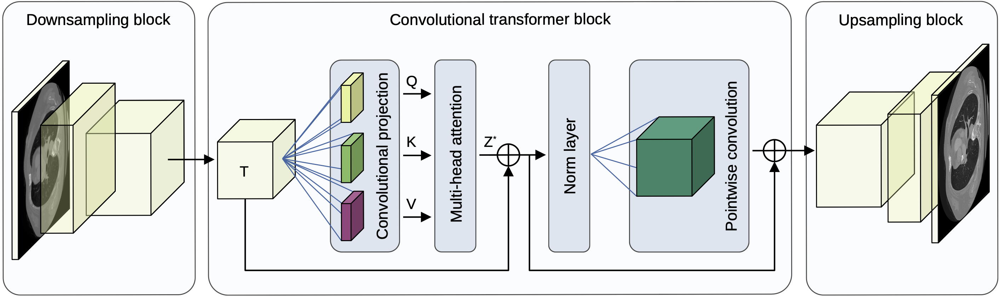
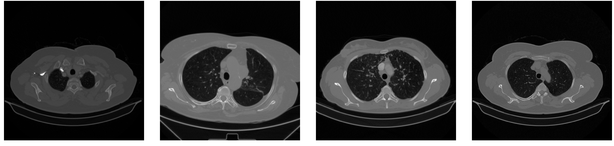

#  CyTran: Cycle-Consistent Transformers for Non-Contrast to Contrast CT Translation                                                                                    

We propose a novel approach to translate unpaired contrast computed tomography (CT) scans 
to non-contrast CT scans and the other way around. 
In addition, we introduce a novel data set, **Coltea-Lung-CT-100W**, containing 3D triphasic 
lung CT scans (with a total of 37,290 images) collected from 100 female patients.

-----------------------------------------

-----------------------------------------
## License

This code is released under the [CC BY-SA 4.0](https://creativecommons.org/licenses/by-sa/4.0/) license.

## Code for CyTran

We provide the code to reproduce our results for CT style transfer. 
The data set must be downloaded and preprocessed. 
Consequently, in options/base_options.py you should put the path to the data set.
In the test.py script is the evaluation code.

The code is similar with CycleGan-and-pix2pix and could be used for any data sets (e.g. horse to zebra, cityscape).
The scripts to download other data sets are in scripts directory.

## Coltea-Lung-CT-100W Data Set

We release a novel data set entitled **Coltea-Lung-CT-100W**, which consists of 100 triphasic lung CT scans. 
The scans are collect from 100 female patients and represent the same body section. 
A triphasic scan is formed of a native (non-contrast) scan, an early portal venous scan, and a late arterial scan. 

In our data set, the three CT scans forming a triphasic scan always have the same number of slices, 
but the number of slices may differ from one patient to another. 

We split our data set into three subsets, one for training (70 scans), one for validation (15 scans), 
and one for testing (15 scans). Our data set is stored as anonymized raw DICOM files.

**Coltea-Lung-CT-100W** can be downloaded from: (link will be released after the acceptance of the submitted manuscript)

## Prerequisites
- Python > 3.6
- PyTorch 1.7.x
- CPU or NVIDIA GPU + CUDA CuDNN

## Citation

BibTeX:

    @article{Ristea-CyTran-2021,
      title={CyTran: Cycle-Consistent Transformers for Non-Contrast to Contrast CT Translation},
      author={Ristea, Nicolae-C{\u{a}}t{\u{a}}lin and Miron, Andreea-Iuliana and Savencu, Olivian and Georgescu, Mariana-Iuliana and Verga, Nicolae and Khan, Fahad Shahbaz and Ionescu, Radu Tudor},
      journal={arXiv preprint arXiv:2110.06400},
      year={2021}
    }

## Related Projects
[cyclegan-pix2pix](https://github.com/junyanz/pytorch-CycleGAN-and-pix2pix) |
[ViT-V-Net](https://github.com/junyuchen245/ViT-V-Net_for_3D_Image_Registration_Pytorch) |
[Recursive-Cascade-Networks](https://github.com/microsoft/Recursive-Cascaded-Networks)  

## You can send your questions or suggestions to: 
r.catalin196@yahoo.ro, raducu.ionescu@gmail.com

### Last Update:
October 20th, 2021
